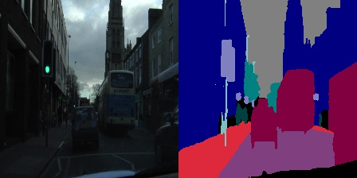

# Squeeze-unet Semantic Segmentation for embedded devices

The model is inspired by [Squeezenet](https://arxiv.org/abs/1602.07360) and [U-Net](https://arxiv.org/abs/1505.04597).

[camvid](https://github.com/alexgkendall/SegNet-Tutorial/tree/master/CamVid), is used as a Dataset.

## Requirements

* Keras 2

## About network

As a typical U-Net architecture, it has encoder and decoder parts, which consist of fire modules proposed by squeezenet.

## TODO

- [ ] Report speed vs accuracy.
- [ ] link for download camvid dataset converted by cvision.
